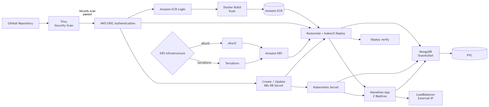

# DevSecOps NameGen
My name is Ori Elimelech, As a part of the Analiza DevSecOps course we were requsted to depoly the namegen app using AWS EKS,
 using Kubernetes, and for the infrastructure you can choose between **eksctl(auto mode cluster)** or **Terraform**.
 
in the project i implement a CI/CD pipeline using **GitHub Actions**, Amazon ECR, Kubernetes, and security scanning with Trivy.

---

## Table of Contents

- [Overview](#overview)
- [CICD](#CICD)
- [Infrastructure Deployment Modes](#infrastructure-deployment-modes)
- [Monitoring](#monitoring)

---

# Overview

NameGen is a Node.js application that generates and stores random names using MongoDB.

The application is containerized using Docker.

<p align="center">
  
</p>

in the CICD pipeline we are doing

1. Security scanning
2. Docker image building
3. Image publishing to Amazon ECR
4. Kubernetes deployment
5. Deployment verification

The infrastructure can be deployed using either:

- `eksctl`
- `Terraform`

Kubernetes resources are managed using *Kustomize overlays*, allowing the same base configuration to be used with different infrastructure deployment methods.

---
<p align="center">
  
</p>

---
# Infrastructure Deployment Modes
when deploying, you can choose the infrastructure you used in the github actions tab, under run workflow- and choosing the right infrastructure.
please note that we already assume you have IAM policy for using github actions if not you can use the follwing:
```
 {
  "Version": "2012-10-17",
  "Statement": [
    {
      "Sid": "EKSDescribeCluster",
      "Effect": "Allow",
      "Action": "eks:DescribeCluster",
      "Resource": "arn:aws:eks:us-east-1:<your-account-id>:cluster/namegen-cluster"
    },
    {
      "Sid": "ECRPushToRepo",
      "Effect": "Allow",
      "Action": [
        "ecr:CompleteLayerUpload",
        "ecr:UploadLayerPart",
        "ecr:InitiateLayerUpload",
        "ecr:BatchCheckLayerAvailability",
        "ecr:PutImage",
        "ecr:BatchGetImage"
      ],
      "Resource": "arn:aws:ecr:us-east-1:<your-account-id>:repository/namegen-app"
    },
    {
      "Sid": "ECRGetAuthToken",
      "Effect": "Allow",
      "Action": "ecr:GetAuthorizationToken",
      "Resource": "*"
    }
  ]
}
 ```

when using eksctl auto mode you can use the following
```eksctl create cluster -f cluster.yaml``` follwing by ```aws eks update-kubeconfig --name namegen-cluster --region us-east-1```
after you should create the ECR repo with:
```aws ecr create-repository  --repository-name namegen-app --region us-east-1 ```

 and then grabt premissions:
 ```
aws eks create-access-entry \
  --cluster-name namegen-cluster \
  --principal-arn arn:aws:iam::<your-account-id>:role/Github_actions_role \
  --type STANDARD

aws eks associate-access-policy \
  --cluster-name namegen-cluster \
  --principal-arn arn:aws:iam::<your-account-id>:role/Github_actions_role \
  --policy-arn arn:aws:eks::aws:cluster-access-policy/AmazonEKSClusterAdminPolicy \
  --access-scope '{"type": "cluster"}'

```
  for the terraform you should just terraform init and then apply.

---

# Monitoring
we can monitor our app using grafana dasboard,
if you choose to use eksctl, you will have to add the kube-prometheus-stack to the cluster
```
# Add the official Prometheus Community Helm repository
helm repo add prometheus-community https://prometheus-community.github.io/helm-charts
helm repo update

# Deploy Prometheus and Grafana into the monitoring namespace
helm install prometheus prometheus-community/kube-prometheus-stack \
  --namespace monitoring \
  --create-namespace
  ```
if youre using terraform you dont need it as its already there from monitoring.tf,
 then port fowrward the grafana service using:
```
kubectl port-forward -n monitoring service/prometheus-grafana 3000:80
```

<p align="center">
  
</p>

---